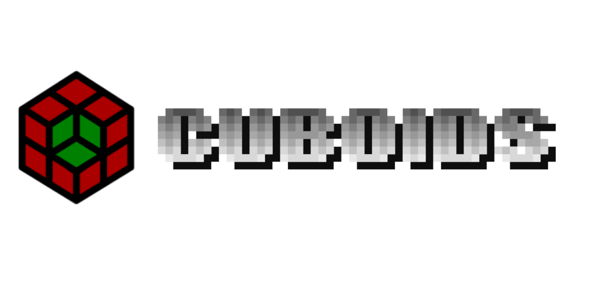

# Table of Contents

1.  [Reconstrue Cuboids](#org0a93fc7)
    1.  [Introduction](#org8f74601)
    2.  [Data Structure](#orgdfb2796)
    3.  [Scope](#orgf6f1c37)
    4.  [Rational](#orgd1f0acd)

# Reconstrue Cuboids

## Introduction

Reconstrue Cuboids integrates various open-source codebases that deals
with [volumetric imaging data](https://en.wikipedia.org/wiki/Volume_rendering) generated by neuroscience
experiments. All code used in Reconstrue Cuboid projects is licensed
in a commercially friendly manner, including those parts written by
Reconstrue. This means that any GPL licensed code is [right out](https://youtu.be/SNTzOBKs1bA?t=96).

## Data Structure

As the name implies, the core data abstraction is cuboids. Cuboid data
can be anisotropic, as required by various experimental modalities.

A cuboid, [as defined by Wolfram](https://mathworld.wolfram.com/Cuboid.html), is a "closed box composed of three
pairs of rectangular faces placed opposite each other and joined at
right angles to each other." Identically shaped cuboids are used to
(3D) tessellate a volume. A voxels are indivisible
cuboids; cuboids are assemblies of voxels.

Cuboids [as defined by bossDB](https://www.biorxiv.org/content/10.1101/217745v2.article-info) (a spatial database) are "multi-channel
3-dimensional image volumes" which means the core data structure has a
4-dimensional address space: three of the dimensions are a voxel's
address in space (X, Y, and Z) and the final dimension is 1-D array of
channel values i.e. various attributes of a given voxel.

A cuboid [as defined by Neuroglancer's precomputed format](https://github.com/google/neuroglancer/blob/master/src/neuroglancer/datasource/precomputed/volume.md) is similarly
shaped: "Each subvolume is conceptually a 4-dimensional [x, y, z,
channel] array."

So, a 4-dimensional array is a data structure which can represent
neuroimaging datasets in implementations both dynamic (bossDB RESTful)
and static (neuroglancers precomputed cuboids format). Therefore,
Reconstrue Cuboids is software which deals with 4-dimensional cuboids.

## Scope

Reconstrue Cuboids is not limited to any specific implementation. The
subject is software which can handle the massive scale and velocity of
data as required by trends in neuroscience. For example, the MICrONS
project involved a single experimental dataset on one cubic millimeter
of brain, which resulted in ~2.5 petabyte of data.

The focus is on the data structure, which is cuboids. There are
multiple potential implementations ranging from static file
representations (e.g. cloud-volume's precomputed fixed cuboids stored
in static files) to RESTful services (e.g. bossDB which can serve up
cuboids of arbitrary coordinates and scale).

Some of the software can handle petabytes of data on commercial cloud
services (e.g. [BossDB on AWS](https://bossdb.org/)) and some only run on a single machine
(e.g. [Bossphorus](https://github.com/aplbrain/bossphorus)).

By focusing on data structures, wire protocols, and APIs solutions can
be developed which can deal with various hardware deployments and 
scale when necessary.

The following are codebases that have been adopted into Reconstrue
Cuboids:

<table border="2" cellspacing="0" cellpadding="6" rules="groups" frame="hsides">

<colgroup>
<col  class="org-left" />

<col  class="org-left" />
</colgroup>
<thead>
<tr>
<th scope="col" class="org-left">Codebase</th>
<th scope="col" class="org-left">License</th>
</tr>
</thead>

<tbody>
<tr>
<td class="org-left">[bossDB](https://github.com/jhuapl-boss/boss)</td>
<td class="org-left">[Apache 2.0](https://github.com/jhuapl-boss/boss/blob/master/LICENSE.md)</td>
</tr>

<tr>
<td class="org-left">[bossphorus](https://github.com/aplbrain/bossphorus)</td>
<td class="org-left">[Apache 2.0](https://github.com/aplbrain/bossphorus/blob/master/LICENSE)</td>
</tr>

<tr>
<td class="org-left">[chunkflow](https://github.com/seung-lab/chunkflow)</td>
<td class="org-left">[Apache 2.0](https://github.com/seung-lab/chunkflow/blob/master/LICENSE)</td>
</tr>

<tr>
<td class="org-left">[cloud-volume](https://github.com/seung-lab/cloud-volume)</td>
<td class="org-left">[BSD 3-Clause](https://github.com/seung-lab/cloud-volume/blob/master/LICENSE)</td>
</tr>

<tr>
<td class="org-left">[JupyterHub](https://jupyter.org/hub)</td>
<td class="org-left">[BSD 3-Clause](https://github.com/jupyterhub/jupyterhub/blob/master/COPYING.md)</td>
</tr>

<tr>
<td class="org-left">[ingest-client](https://github.com/jhuapl-boss/ingest-client)</td>
<td class="org-left">[Apache 2.0](https://github.com/jhuapl-boss/ingest-client/blob/master/LICENSE)</td>
</tr>

<tr>
<td class="org-left">[intern](https://github.com/jhuapl-boss/intern)</td>
<td class="org-left">[Apache 2.0](https://github.com/jhuapl-boss/intern/blob/master/license)</td>
</tr>

<tr>
<td class="org-left">precomputed</td>
<td class="org-left">???</td>
</tr>

<tr>
<td class="org-left">[SABER](https://github.com/aplbrain/saber)</td>
<td class="org-left">[Apache 2.0](https://github.com/aplbrain/saber/blob/master/LICENSE)</td>
</tr>
</tbody>
</table>

## Rational

Most of the software labeled "Reconstrue Cuboids" is actually third
party i.e. written by people who are not part of the organization,
Reconstrue. "Reconstrue Cuboids" is simply a label on source code
denoting that it has been exercised by Reconstrue, and found to be
suitable to task. These are tools that have been used together in
projects. As such, Reconstrue's early contribution is in working out
component integration, in aspects both technical and legal. For
example, one project involves a system which uses [bossDB](https://bossdb.org/) with
[chunkflow](https://github.com/seung-lab/chunkflow) to reconstruct neurons from brightfield microscope image
stacks.

Beyond tactical progress on any given project, the strategic community
value of this Reconstrue Cuboids exercise is that corporate entities
(Reconstrue included) can build upon the code and not have to consult
with lawyers up-front (of course, talk to your lawyers; no warrenty
implied herein). The mail goal is to increase the rate of open source
innovation in this field. For more on the rational behind this, see
[Reconstrue Stack](https://github.com/reconstrue/presentations/blob/master/bioimage_2019/bioimage_2019_poster.pdf).

